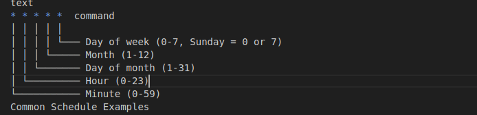

dailyupkeep
Daily Linux System Upkeep Script

A simple bash script for automated daily maintenance of Linux systems using the apt package manager.

What This Script Does
Updates the package database (apt update)

Upgrades installed packages (apt upgrade -y)

Removes unused packages (apt autoremove -y)

Cleans package cache (apt autoclean)

Reports disk usage

Logs all activities with timestamps

Files
dailyupkeep.sh - Main maintenance script

Installation
Make the script executable

bash
chmod +x dailyupkeep.sh
Move to system location (recommended)

bash
sudo cp dailyupkeep.sh /usr/local/bin/dailyupkeep
sudo chmod +x /usr/local/bin/dailyupkeep
Test the script manually

bash
/usr/local/bin/dailyupkeep
Setting Up Automated Execution (Cron Job)
Option 1: Run as root (recommended for apt commands)
bash
sudo crontab -e
Add this line to run daily at 2 AM with logging:

text
0 2 * * * /usr/local/bin/dailyupkeep >> /var/log/dailyupkeep.log 2>&1
Option 2: Multiple times per day (for systems that aren't always on)
bash
sudo crontab -e
Add this line to run at 8 AM, 2 PM, and 8 PM:

text
0 8,14,20 * * * /usr/local/bin/dailyupkeep >> /var/log/dailyupkeep.log 2>&1
Option 3: Run at startup (for laptops/desktops)
Add this line to also run at boot:

text
@reboot sleep 60 && /usr/local/bin/dailyupkeep >> /var/log/dailyupkeep.log 2>&1
Cron Schedule Format
text

bash
# Daily at 2:00 AM
0 2 * * * /usr/local/bin/dailyupkeep

# Every 6 hours
0 */6 * * * /usr/local/bin/dailyupkeep

# Weekdays only at 9 AM
0 9 * * 1-5 /usr/local/bin/dailyupkeep

# Weekly on Sunday at 3 AM
0 3 * * 0 /usr/local/bin/dailyupkeep
Checking If It's Working
View scheduled cron jobs

bash
# Your user's cron jobs
crontab -l

# Root cron jobs
sudo crontab -l
Check cron service status

bash
sudo systemctl status cron
Monitor cron activity

bash
# Real-time cron monitoring
sudo tail -f /var/log/syslog | grep CRON

# Check cron logs
journalctl -u cron
Check your log file

bash
# View the log file
tail -f /var/log/dailyupkeep.log

# Check recent activity
ls -la /var/log/dailyupkeep.log
Test with a temporary job
Add this line to run every minute for testing:

text
* * * * * echo "Test at $(date)" >> /tmp/crontest.log
Check the results:

bash
cat /tmp/crontest.log
Troubleshooting
Permission denied: Make sure the script is executable (chmod +x)

Command not found: Use full paths in your script (/usr/bin/apt instead of apt)

No output: Add logging to your cron job (>> /path/to/log 2>&1)

Sudo issues: Run as root cron or configure passwordless sudo

Script Requirements
Ubuntu/Debian-based Linux distribution

Root privileges (for apt commands)

Active internet connection (for package updates)

Environment Considerations
Laptops/Desktops: Use multiple daily schedules or startup execution

Servers: Single daily schedule is usually sufficient

Limited uptime systems: Consider using anacron instead of cron

Log Output Example
text
=== Daily upkeep started at Mon Jan 15 02:00:01 UTC 2024 ===
Updating package lists...
Hit:1 http://archive.ubuntu.com/ubuntu jammy InRelease
Reading package lists...
Upgrading packages...
Reading package lists...
Building dependency tree...
0 upgraded, 0 newly installed, 0 to remove and 0 not upgraded.
Cleaning up...
Disk usage:
/dev/sda1        20G  8.1G   11G  43% /
=== Daily upkeep completed at Mon Jan 15 02:00:45 UTC 2024 ===
Security Notes
The script requires sudo/root privileges

Only runs standard system maintenance commands

All activities are logged for audit purposes

No external scripts or downloads are executed

License
This script is provided as-is for system maintenance purposes. Use at your own discretion.

